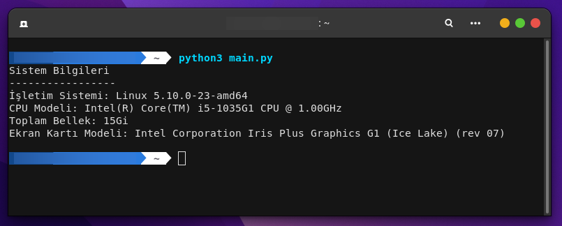

<a href="https://github.com/pedromxavier/flag-badges">
    
</a>

# systeminforme
this code allows you to learn linux system knowledge with python3

Install Git Clone and Python3

Github Package Must Be Installed On Your Device.
```bash
sudo apt install git -y
```

Python3 Package Must Be Installed On Your Device.
```bash
sudo apt install python3 -y
```

----------------------------------
# Installation
Install cleaning
```bash
sudo git clone https://github.com/cektor/systeminforme.git
```
```bash
cd systeminforme/
```

```bash
python3 main.py
```


# Screenshot

 
